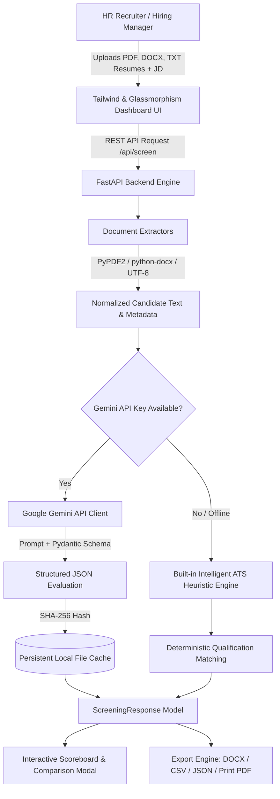

# ResumeScreen AI — Intelligent ATS Resume Screening & Candidate Evaluation Engine

<div align="center">


**An enterprise-grade, high-aesthetic AI resume screening platform powered by Google Gemini and FastAPI.**  
Objective ATS scoring, candidate comparison, actionable skill gap analysis, interview question generation, and multi-format report exports.

[Key Features](#-key-features) • [Architecture](#-architecture) • [Quick Start](#-quick-start) • [API Reference](#-api-reference) • [Project Structure](#-project-structure)

</div>

---

## ⚡ Highlights & Value Proposition

Traditional applicant tracking systems rely on brittle keyword counts that reject qualified applicants and let keyword-stuffed resumes slip through. **ResumeScreen AI** solves this with a dual-engine architecture:

1. **Google Gemini Reasoning Engine**: Uses state-of-the-art multimodal reasoning models (Gemini 2.5 Flash, 2.0 Flash, 1.5 Pro) with structured Pydantic schemas to evaluate qualitative experience, context, and project impact.
2. **Built-in Intelligent ATS Engine**: Automatically activates when an API key is omitted or quota is constrained, providing instant, reliable evaluations without blocking the recruitment workflow.

---

## ✨ Key Features

### 🎯 Deep Candidate Scoring & Gap Analysis
- **0–100% Objective Match Score**: Weighted assessment of core technical skills, hands-on production experience, and domain requirements.
- **Identified Strengths & Critical Gaps**: Concrete bullet points detailing exactly where the applicant shines and what required qualifications are missing.
- **Executive Recruitment Verdict**: Automatically selects the top recommended hire with strategic trade-off analysis across all screened applicants.

### ⚖️ Side-by-Side Candidate Comparison Modal
- Select any two candidates from your applicant pool to contrast their match scores, delta differences, strengths, and development areas side-by-side.

### 🎙️ Interactive Recruiter Interview Kit
- **Tailored Interview Questions**: Exactly 3 deep technical questions designed to test and verify the candidate's specific qualification gaps.
- **Text-to-Speech (TTS) Audio Preview**: Built-in speech synthesis allows hiring managers to listen to interview prompts aloud.
- **1-Click Clipboard Copying**: Instant copy buttons with visual feedback to paste questions straight into your recruitment notes or ATS.

### 📊 Real-Time Scoreboard, Search & Filtering
- **Live Search Bar**: Instantly filter candidates by name, job title, or skill keywords.
- **Interactive Threshold Sliders**: Adjust passing standards (High Fit ≥80%, Moderate Fit 60–79%) in real-time with automatic re-ranking.
- **Rank Medals**: Visual badges (🥇 #1 Winner, 🥈 #2 Runner-up, 🥉 #3 Third place).

### 📑 Universal Document Parsing
- Seamlessly extracts text and metadata from **Adobe PDF (`.pdf`)**, **Microsoft Word (`.docx`)**, and **Plain Text (`.txt`)** documents.
- Includes OCR scan detection and extraction confidence scoring.

### 💾 SHA-256 Persistent Local Caching
- Eliminates duplicate API costs. Screened results are hashed and cached locally for instant, sub-millisecond retrieval on repeat evaluations.

### 📤 Multi-Format Export Suite
- **Microsoft Word (`.docx`)**: Styled executive ATS evaluation report ready to share with stakeholders.
- **CSV Spreadsheet (`.csv`)**: Export candidate rankings, scores, and gaps for Excel / Google Sheets.
- **Structured JSON (`.json`)**: Complete evaluation payload for custom HRIS integrations.
- **Print / PDF**: Clean, print-optimized document view.

### 🎨 Glassmorphism 2.0 UI
- Ambient mesh glow backdrop, tailored HSL color palettes, dark/light theme toggle, radial progress gauge, and mobile-responsive layout.

---

## 🏗️ Architecture



---

## 🚀 Quick Start

### 1. Prerequisites
- **Python 3.10** or higher
- **Google Gemini API Key**: [Get a free API key from Google AI Studio](https://aistudio.google.com/app/apikey) to evaluate candidates using Gemini AI reasoning models.

### 2. Clone the Repository
```bash
git clone https://github.com/ayushbarve9/resume-screener.git
cd resume-screener
```

### 3. Setup Virtual Environment & Dependencies
```bash
# Windows (PowerShell)
python -m venv .venv
.\.venv\Scripts\Activate.ps1
pip install -r requirements.txt

# macOS / Linux
python3 -m venv .venv
source .venv/bin/activate
pip install -r requirements.txt
```

### 4. Configure API Key (Optional)
You can configure your API key in any of the following ways:
- **Directly in the UI**: Click the **"API Key"** button in the top navigation bar and save your key (stored securely in browser `localStorage`).
- **Via Environment Variable**: Create a `.env` file in the project root:
  ```env
  GOOGLE_API_KEY=your_gemini_api_key_here
  ```

### 5. Launch the Dashboard
Run the automated launcher:
```bash
python run.py
```
Or start Uvicorn directly:
```bash
uvicorn main:app --host 0.0.0.0 --port 8000 --reload
```

Open your browser at:
```
http://localhost:8000
```

---

## 🔌 API Reference

### `GET /api/config`
Returns server configuration, available Gemini models, default scoring thresholds, and server-side API key detection.

**Response:**
```json
{
  "has_env_key": true,
  "models": {
    "Gemini 2.5 Flash (Recommended)": "gemini-2.5-flash",
    "Gemini 2.0 Flash": "gemini-2.0-flash",
    "Gemini 1.5 Flash": "gemini-1.5-flash",
    "Gemini 1.5 Pro": "gemini-1.5-pro"
  },
  "thresholds": {
    "high": 80,
    "medium": 60
  }
}
```

---

### `POST /api/screen`
Uploads candidate resume files along with the target job description to produce full ATS scoring and evaluation.

**Parameters (Multipart Form):**
- `job_description` *(string, required)*: The target job description text.
- `model_name` *(string, required)*: Gemini model identifier (e.g. `gemini-2.5-flash`).
- `api_key` *(string, optional)*: User-provided Gemini API key (falls back to env key or heuristic engine).
- `resumes` *(list of files, required)*: 1 to 10 resume files (`.pdf`, `.docx`, `.txt`).

**Response:**
```json
{
  "success": true,
  "engine_used": "gemini",
  "was_cached": false,
  "has_api_key": true,
  "response": {
    "evaluations": [
      {
        "candidate_name": "Alex Chen",
        "target_position": "Senior Machine Learning Engineer",
        "match_score": 92,
        "gap_analysis": "Alex demonstrates exceptional alignment in PyTorch, Transformer fine-tuning, and RAG pipelines...",
        "strengths": [
          "Deep production expertise with RAG architectures and vector search",
          "Extensive experience with PyTorch and distributed GPU inference",
          "Strong background in containerized microservices and Kubernetes"
        ],
        "gaps": [
          "Limited explicit experience with TensorRT quantization",
          "Could highlight more direct team mentorship metrics"
        ],
        "interview_questions": [
          "Can you walk through your RAG pipeline and how you minimized retrieval latency?",
          "How do you approach quantization and model pruning when deploying LLMs on resource-constrained GPUs?",
          "Describe your experience debugging memory bottlenecks during distributed model training."
        ],
        "resume_revisions": [
          "Explicitly quantify inference latency improvements achieved in production",
          "Add specific metrics on GPU cluster cost optimizations",
          "Detail experience with TensorRT or ONNX Runtime"
        ]
      }
    ],
    "executive_summary": {
      "winner_name": "Alex Chen",
      "justification": "Alex achieved the highest ATS match rating (92%) with the closest demonstrated coverage of core requirements.",
      "rankings": ["Alex Chen", "Sarah Lin", "Marcus Vance"],
      "trade_offs": [
        "Alex Chen exhibits deeper ML and RAG pipeline engineering experience, while Sarah Lin presents stronger full-stack web capabilities."
      ]
    }
  },
  "metadata": {
    "Alex_Chen.txt": {
      "page_count": 1,
      "is_scanned": false,
      "confidence_score": 1.0
    }
  },
  "warnings": []
}
```

---

### `POST /api/export/docx`
Generates a styled Microsoft Word report (`.docx`) containing the executive summary, rankings, and candidate profiles.

**Parameters (Form Data):**
- `job_title` *(string, required)*: Name of the role being evaluated.
- `screening_response_json` *(string, required)*: Serialized JSON evaluation payload from `/api/screen`.

---

## 📁 Project Structure

```
resume-screening-dashboard/
├── main.py                  # FastAPI server, REST routes, static file hosting
├── config.py                # Supported AI models, prompt templates, threshold presets
├── evaluator.py             # Gemini API client, cache manager, and heuristic ATS fallback
├── extractors.py            # PDF, DOCX, and TXT parsing with OCR detection
├── models.py                # Pydantic v2 data schemas for structured outputs
├── report_generator.py      # Styled Microsoft Word (.docx) report generator
├── run.py                   # Automated setup, venv management, and launcher
├── requirements.txt         # Production Python dependencies
├── index.html               # Single-page Glassmorphism 2.0 dashboard application
├── render.yaml              # Cloud deployment configuration
└── README.md                # Project documentation and developer guide
```

---

## 🛡️ License

This project is licensed under the [MIT License](LICENSE). Free for personal, commercial, and educational use.